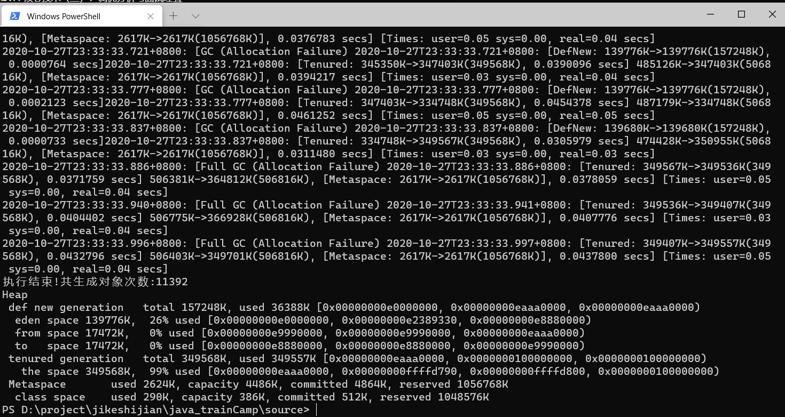
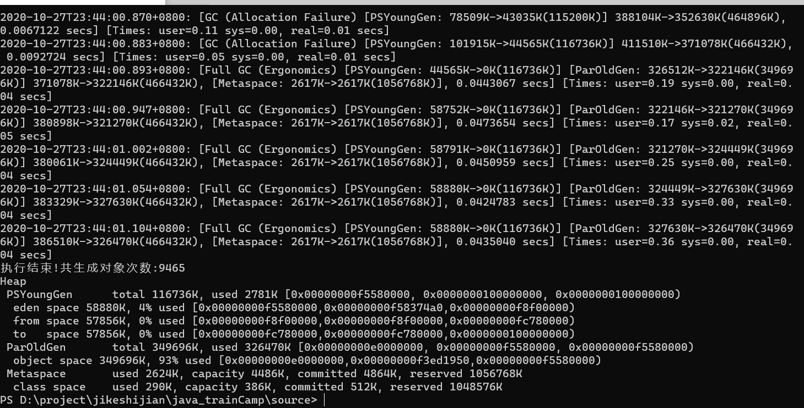
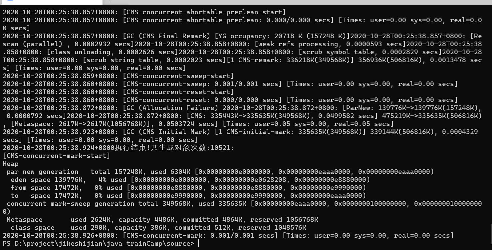
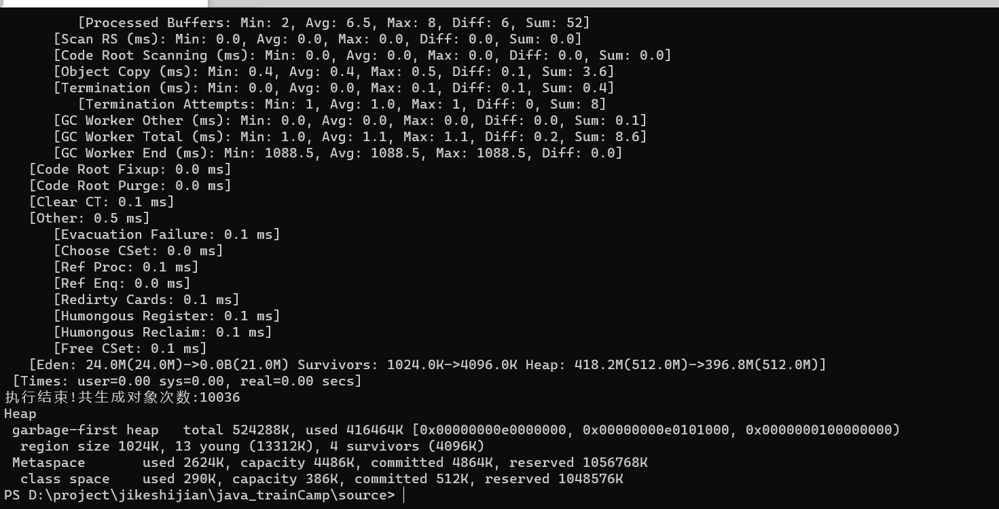

# 总结

## 一、串行化GC

单线程做GC，用的时间比较长

Minor GC Eden区和存活区S0复制到S1，同时有部分GC进入到老年代

Full GC 把老年代全部回收掉

## 二、并行GC

younggc时只清理young区，不清理old区，eden区和s0复制到s1,然后清空eden区和s0，部分到old区

FullGC时，清理young区，old区不活跃的数据也清理

## 三、CMSGC

四、G1GC

4G时或内存特别小时，差不多；内存比较小时，FullGC运行时间比较长